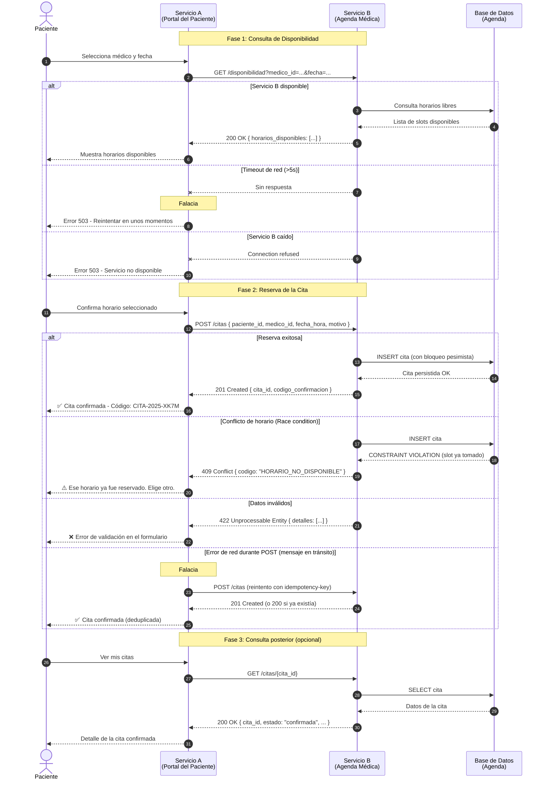

# Definición de Contratos y Debate Técnico de Protocolos: REST vs. gRPC
### Caso de uso: Sistema de Reserva de Citas Médicas

---

## 1. Introducción

En los sistemas de salud digitales actuales, la integración entre plataformas es un requisito crítico. Un paciente que solicita una cita médica a través de un portal web desencadena una cadena de comunicaciones síncronas entre múltiples servicios: el portal de pacientes debe consultar en tiempo real la disponibilidad de un médico y confirmar o rechazar la reserva antes de que el usuario abandone la pantalla.

Este escenario plantea un desafío técnico concreto: dos sistemas deben intercambiar información sensible —datos del paciente, disponibilidad del médico, confirmación del horario— de forma síncrona, con baja latencia y manejo explícito de errores. El **Servicio A** es el Portal del Paciente (cliente), y el **Servicio B** es el Servicio de Agenda Médica (servidor).

El presente documento define el contrato de integración entre ambos servicios utilizando el enfoque **REST con OpenAPI 3.0**, elabora el diagrama de orquestación del flujo de mensajes e incluye un análisis comparativo fundamentado sobre las implicaciones de usar REST frente a gRPC en este contexto.

---

## 2. Especificación Técnica: Contrato OpenAPI (YAML)

```yaml
openapi: 3.0.3
info:
  title: API de Reserva de Citas Médicas
  description: >
    Contrato de integración entre el Portal del Paciente (Servicio A)
    y el Servicio de Agenda Médica (Servicio B).
    Permite consultar disponibilidad y confirmar citas médicas.
  version: 1.0.0
  contact:
    name: Equipo de Integración
    email: integracion@clinica.com

servers:
  - url: https://api.clinica.com/v1
    description: Servidor de producción
  - url: https://staging.api.clinica.com/v1
    description: Servidor de pruebas

paths:
  /disponibilidad:
    get:
      summary: Consultar disponibilidad de un médico
      operationId: getDisponibilidad
      tags:
        - Agenda
      parameters:
        - name: medico_id
          in: query
          required: true
          description: Identificador único del médico
          schema:
            type: string
            format: uuid
            example: "d290f1ee-6c54-4b01-90e6-d701748f0851"
        - name: fecha
          in: query
          required: true
          description: Fecha para la consulta (formato ISO 8601)
          schema:
            type: string
            format: date
            example: "2025-06-15"
        - name: especialidad
          in: query
          required: false
          description: Filtrar por especialidad médica
          schema:
            type: string
            enum: [cardiologia, pediatria, medicina_general, dermatologia]
      responses:
        "200":
          description: Lista de horarios disponibles
          content:
            application/json:
              schema:
                $ref: "#/components/schemas/DisponibilidadResponse"
        "400":
          description: Parámetros inválidos o faltantes
          content:
            application/json:
              schema:
                $ref: "#/components/schemas/ErrorResponse"
        "404":
          description: Médico no encontrado
          content:
            application/json:
              schema:
                $ref: "#/components/schemas/ErrorResponse"
        "503":
          description: Servicio de agenda temporalmente no disponible
          content:
            application/json:
              schema:
                $ref: "#/components/schemas/ErrorResponse"

  /citas:
    post:
      summary: Crear una nueva reserva de cita médica
      operationId: crearCita
      tags:
        - Agenda
      requestBody:
        required: true
        content:
          application/json:
            schema:
              $ref: "#/components/schemas/CrearCitaRequest"
      responses:
        "201":
          description: Cita creada exitosamente
          content:
            application/json:
              schema:
                $ref: "#/components/schemas/CitaConfirmadaResponse"
        "400":
          description: Datos de la solicitud inválidos
          content:
            application/json:
              schema:
                $ref: "#/components/schemas/ErrorResponse"
        "409":
          description: Conflicto — el horario ya fue reservado por otro paciente
          content:
            application/json:
              schema:
                $ref: "#/components/schemas/ErrorResponse"
        "422":
          description: Entidad no procesable — campos con formato incorrecto
          content:
            application/json:
              schema:
                $ref: "#/components/schemas/ErrorResponse"
        "503":
          description: Servicio no disponible
          content:
            application/json:
              schema:
                $ref: "#/components/schemas/ErrorResponse"

  /citas/{cita_id}:
    get:
      summary: Obtener detalle de una cita existente
      operationId: getCita
      tags:
        - Agenda
      parameters:
        - name: cita_id
          in: path
          required: true
          description: Identificador único de la cita
          schema:
            type: string
            format: uuid
      responses:
        "200":
          description: Detalle de la cita
          content:
            application/json:
              schema:
                $ref: "#/components/schemas/CitaConfirmadaResponse"
        "404":
          description: Cita no encontrada
          content:
            application/json:
              schema:
                $ref: "#/components/schemas/ErrorResponse"

    delete:
      summary: Cancelar una cita médica
      operationId: cancelarCita
      tags:
        - Agenda
      parameters:
        - name: cita_id
          in: path
          required: true
          schema:
            type: string
            format: uuid
      responses:
        "204":
          description: Cita cancelada exitosamente (sin contenido)
        "404":
          description: Cita no encontrada
          content:
            application/json:
              schema:
                $ref: "#/components/schemas/ErrorResponse"

components:
  schemas:

    CrearCitaRequest:
      type: object
      required:
        - paciente_id
        - medico_id
        - fecha_hora
        - motivo
      properties:
        paciente_id:
          type: string
          format: uuid
          description: Identificador único del paciente (obligatorio)
          example: "a1b2c3d4-e5f6-7890-abcd-ef1234567890"
        medico_id:
          type: string
          format: uuid
          description: Identificador único del médico (obligatorio)
          example: "d290f1ee-6c54-4b01-90e6-d701748f0851"
        fecha_hora:
          type: string
          format: date-time
          description: Fecha y hora de la cita en ISO 8601 UTC (obligatorio)
          example: "2025-06-15T10:30:00Z"
        motivo:
          type: string
          description: Motivo de la consulta (obligatorio, máx. 500 caracteres)
          maxLength: 500
          example: "Control anual de presión arterial"
        notas_adicionales:
          type: string
          description: Información adicional para el médico (opcional)
          maxLength: 1000
          example: "Paciente con alergia a penicilina"
        modalidad:
          type: string
          description: Modalidad de la cita (opcional, default presencial)
          enum: [presencial, teleconsulta]
          default: presencial

    DisponibilidadResponse:
      type: object
      properties:
        medico_id:
          type: string
          format: uuid
        fecha:
          type: string
          format: date
        horarios_disponibles:
          type: array
          items:
            type: object
            properties:
              hora_inicio:
                type: string
                format: time
                example: "09:00"
              hora_fin:
                type: string
                format: time
                example: "09:30"
              disponible:
                type: boolean

    CitaConfirmadaResponse:
      type: object
      properties:
        cita_id:
          type: string
          format: uuid
          description: Identificador único generado para la cita
        paciente_id:
          type: string
          format: uuid
        medico_id:
          type: string
          format: uuid
        fecha_hora:
          type: string
          format: date-time
        estado:
          type: string
          enum: [confirmada, pendiente, cancelada]
        codigo_confirmacion:
          type: string
          description: Código alfanumérico para recordatorio
          example: "CITA-2025-XK7M"
        creado_en:
          type: string
          format: date-time

    ErrorResponse:
      type: object
      required:
        - codigo
        - mensaje
      properties:
        codigo:
          type: string
          description: Código interno del error
          example: "HORARIO_NO_DISPONIBLE"
        mensaje:
          type: string
          description: Descripción legible del error
          example: "El horario solicitado ya no está disponible"
        detalles:
          type: array
          items:
            type: string
          description: Lista de errores específicos de validación
        timestamp:
          type: string
          format: date-time

  securitySchemes:
    BearerAuth:
      type: http
      scheme: bearer
      bearerFormat: JWT

security:
  - BearerAuth: []
```

---

## 3. Diagrama de Orquestación (Mermaid)

> Copiar en cualquier editor compatible con Mermaid (draw.io, Notion, GitLab, etc.)



---

## 4. Cuadro Comparativo y Discusión: REST vs. gRPC aplicado al caso

### 4.1 Tabla comparativa

| Dimensión | REST (JSON / HTTP 1.1) | gRPC (Protocol Buffers / HTTP/2) | Impacto en este caso de uso |
|---|---|---|---|
| **Latencia** | Mayor: cabeceras HTTP/1.1 sin comprimir, JSON verboso | Menor: multiplexación HTTP/2, binario compacto | Para consultar disponibilidad en tiempo real, gRPC reduciría el tiempo de respuesta, crítico si el usuario espera en pantalla |
| **Tamaño del payload** | JSON texto plano: un objeto `CrearCitaRequest` puede pesar ~400–600 bytes | Protobuf binario: el mismo mensaje ocupa ~80–120 bytes (reducción ~75–80%) | En redes móviles lentas o inestables, la diferencia es perceptible para el paciente |
| **Facilidad de depuración** | Alta: cualquier navegador, curl o Postman puede inspeccionar el tráfico directamente | Baja: el binario no es legible sin herramientas especializadas (grpcurl, Wireshark con plugin) | En un equipo médico donde el personal de TI puede no ser senior, REST facilita el soporte en producción |
| **Acoplamiento cliente-servidor** | Bajo: el cliente solo necesita conocer la URL y el esquema JSON; el contrato puede versionarse en la URL (`/v1`, `/v2`) | Alto: cliente y servidor deben compartir y recompilar el mismo archivo `.proto`; un cambio de campo rompe ambos lados si no se gestiona con cuidado | En un entorno hospitalario con múltiples equipos de desarrollo, el acoplamiento fuerte de gRPC puede ser un riesgo operacional |
| **Soporte en navegadores** | Nativo: cualquier navegador puede llamar a la API directamente | Limitado: requiere gRPC-Web y un proxy intermediario (Envoy) para operar desde el frontend | El Portal del Paciente corre en navegador; REST no requiere infraestructura adicional |
| **Streaming y notificaciones** | No nativo en HTTP/1.1; requiere WebSockets o Server-Sent Events separados | Nativo: gRPC soporta streaming bidireccional sin capas adicionales | Si en el futuro se requiere notificación push de confirmación, gRPC ofrece una ventaja arquitectónica clara |
| **Manejo de errores** | Semántica HTTP estándar (4xx, 5xx) universalmente comprendida | Códigos de estado gRPC propios (UNAVAILABLE, DEADLINE_EXCEEDED, etc.) bien definidos pero menos familiares | Ambos son adecuados; REST es más predecible para equipos con menor experiencia en RPC |
| **Contrato formal** | OpenAPI/Swagger: amplio ecosistema de generación de clientes, documentación interactiva | `.proto`: contrato estrictamente tipado, genera código en múltiples lenguajes automáticamente | Para una API expuesta a terceros (otras clínicas), OpenAPI es más accesible |

### 4.2 Análisis argumentado

**Latencia y carga útil**

En el flujo de reserva de cita, el `POST /citas` transfiere datos personales del paciente, identificadores de médico y metadatos temporales. Con REST y JSON sobre HTTP/1.1, cada solicitud establece una nueva conexión TCP (o reutiliza una existente con keep-alive), y el payload se transmite como texto UTF-8. Un campo `fecha_hora` en ISO 8601 ocupa 20 caracteres; en Protobuf se codificaría como un entero de 64 bits (8 bytes). Esta diferencia es marginal en una LAN hospitalaria, pero se vuelve significativa si el sistema opera sobre redes 4G/LTE donde el paciente accede desde su teléfono móvil.

Con gRPC sobre HTTP/2, la multiplexación permite enviar la consulta de disponibilidad y otra petición simultáneamente sobre la misma conexión TCP, eliminando el problema de head-of-line blocking presente en HTTP/1.1. Si la clínica maneja picos de carga (por ejemplo, lunes a las 8 AM cuando cientos de pacientes abren el portal), gRPC escalaría mejor bajo presión.

**Facilidad de depuración**

La facilidad de depuración es el argumento más fuerte a favor de REST en este escenario. El personal técnico de una clínica mediana puede reproducir cualquier error con un simple `curl -X POST https://api.clinica.com/v1/citas -d '{...}'`. Los logs de Apache o Nginx muestran el JSON completo del cuerpo. Con gRPC, un error reportado por un médico que no puede agendar su cita requiere capturar paquetes con Wireshark y decodificarlos con el plugin Protobuf, o instalar `grpcurl` en el servidor. Esta brecha operacional no es menor en entornos donde el equipo de soporte no siempre es un ingeniero de plataformas.

**Acoplamiento entre cliente y servidor**

El acoplamiento es la dimensión más crítica para la mantenibilidad a largo plazo. REST con OpenAPI permite que el Portal del Paciente evolucione independientemente del Servicio de Agenda: si se añade el campo `notas_adicionales` al contrato, los clientes que no lo envíen siguen funcionando porque el campo es opcional. En gRPC, cualquier cambio en el archivo `.proto` requiere recompilar y redistribuir el stub del cliente, lo que implica una coordinación de despliegue entre equipos. En un hospital donde el sistema de agenda puede ser de un proveedor externo y el portal de otro, este ciclo de recompilación puede convertirse en un cuello de botella.

**Conclusión del análisis**

Para el caso de uso de reserva de citas médicas, **REST es la opción más adecuada en la capa de integración externa** (paciente ↔ portal ↔ agenda), dada la necesidad de depuración accesible, soporte nativo en navegadores y bajo acoplamiento entre equipos heterogéneos. No obstante, si el sistema escala hacia una arquitectura de microservicios internos —donde el Servicio de Agenda debe comunicarse con un Servicio de Notificaciones, un Servicio de Historial Clínico y un Servicio de Facturación de forma síncrona y de alto rendimiento— **gRPC sería la tecnología preferida para esa capa interna**, aprovechando el streaming y la eficiencia del transporte binario donde la depuración la realiza el equipo de ingeniería y no el soporte general.

---

## 5. Enlace al Repositorio de GitHub

> **Instrucción:** Crea un repositorio público en GitHub con el nombre `citas-medicas-api-contract` y sube los siguientes archivos:

```
citas-medicas-api-contract/
├── openapi/
│   └── citas-medicas.yaml        ← El YAML de la sección 2
├── diagrams/
│   └── secuencia-reserva.md      ← El diagrama Mermaid de la sección 3
└── README.md                     ← Descripción del proyecto
```

**URL de ejemplo (reemplazar con la tuya):**

```
https://github.com/nicevall/ARQ_PE_Actividad_S2.git
```

**README.md sugerido:**

```markdown
# API de Reserva de Citas Médicas — Definición de Contrato

Repositorio de definición de interfaces para la integración entre el Portal del
Paciente (Servicio A) y el Servicio de Agenda Médica (Servicio B).

## Contenido
- `openapi/citas-medicas.yaml` — Contrato REST en formato OpenAPI 3.0
- `diagrams/secuencia-reserva.md` — Diagrama de secuencia en Mermaid

## Cómo visualizar el contrato
1. Accede a https://editor.swagger.io/
2. Pega el contenido de `citas-medicas.yaml`
3. Explora los endpoints interactivamente

## Tecnologías
- REST / OpenAPI 3.0 (Swagger)
- JWT para autenticación
- HTTP/1.1
```

---

## Referencias

- OpenAPI Initiative. (2021). *OpenAPI Specification 3.0.3*. https://spec.openapis.org/oas/v3.0.3
- Google. (2023). *Protocol Buffers Documentation*. https://protobuf.dev/
- Google. (2023). *gRPC Documentation — Core Concepts*. https://grpc.io/docs/what-is-grpc/core-concepts/
- Fielding, R. T. (2000). *Architectural styles and the design of network-based software architectures* [Doctoral dissertation, University of California, Irvine]. https://ics.uci.edu/~fielding/pubs/dissertation/top.htm
- Deutsch, L. P. (1994). *The eight fallacies of distributed computing*. Sun Microsystems. https://nighthacks.com/jag/res/Fallacies.html
- Richardson, L., & Ruby, S. (2007). *RESTful Web Services*. O'Reilly Media.
- Indrasiri, K., & Kuruppu, D. (2021). *gRPC: Up and Running*. O'Reilly Media. https://www.oreilly.com/library/view/grpc-up-and/9781492058328/
- Swagger. (2023). *Swagger Editor*. https://editor.swagger.io/
