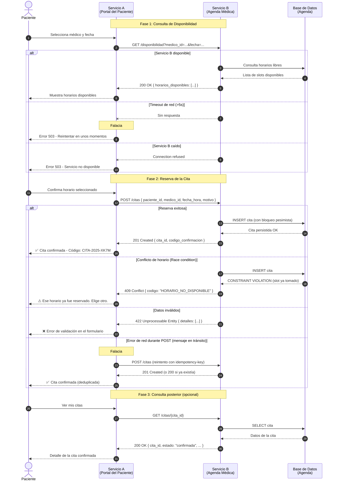

```mermaid
sequenceDiagram
    autonumber
    actor Paciente
    participant PortalPaciente as Servicio A<br/>(Portal del Paciente)
    participant AgendaMedica as Servicio B<br/>(Agenda Médica)
    participant BD as Base de Datos<br/>(Agenda)

    Note over PortalPaciente, AgendaMedica: Fase 1: Consulta de Disponibilidad

    Paciente->>PortalPaciente: Selecciona médico y fecha
    PortalPaciente->>AgendaMedica: GET /disponibilidad?medico_id=...&fecha=...
    
    alt Servicio B disponible
        AgendaMedica->>BD: Consulta horarios libres
        BD-->>AgendaMedica: Lista de slots disponibles
        AgendaMedica-->>PortalPaciente: 200 OK { horarios_disponibles: [...] }
        PortalPaciente-->>Paciente: Muestra horarios disponibles
    else Timeout de red (>5s)
        AgendaMedica--xPortalPaciente: Sin respuesta
        Note over PortalPaciente: Falacia #1: La red NO siempre es confiable
        PortalPaciente-->>Paciente: Error 503 - Reintentar en unos momentos
    else Servicio B caído
        AgendaMedica--xPortalPaciente: Connection refused
        PortalPaciente-->>Paciente: Error 503 - Servicio no disponible
    end

    Note over PortalPaciente, AgendaMedica: Fase 2: Reserva de la Cita

    Paciente->>PortalPaciente: Confirma horario seleccionado
    PortalPaciente->>AgendaMedica: POST /citas { paciente_id, medico_id, fecha_hora, motivo }

    alt Reserva exitosa
        AgendaMedica->>BD: INSERT cita (con bloqueo pesimista)
        BD-->>AgendaMedica: Cita persistida OK
        AgendaMedica-->>PortalPaciente: 201 Created { cita_id, codigo_confirmacion }
        PortalPaciente-->>Paciente: ✅ Cita confirmada - Código: CITA-2025-XK7M
    else Conflicto de horario (Race condition)
        AgendaMedica->>BD: INSERT cita
        BD-->>AgendaMedica: CONSTRAINT VIOLATION (slot ya tomado)
        AgendaMedica-->>PortalPaciente: 409 Conflict { codigo: "HORARIO_NO_DISPONIBLE" }
        PortalPaciente-->>Paciente: ⚠️ Ese horario ya fue reservado. Elige otro.
    else Datos inválidos
        AgendaMedica-->>PortalPaciente: 422 Unprocessable Entity { detalles: [...] }
        PortalPaciente-->>Paciente: ❌ Error de validación en el formulario
    else Error de red durante POST (mensaje en tránsito)
        Note over PortalPaciente: Falacia #2: La latencia NO es cero<br/>Falacia #5: La topología NO cambia
        PortalPaciente->>AgendaMedica: POST /citas (reintento con idempotency-key)
        AgendaMedica-->>PortalPaciente: 201 Created (o 200 si ya existía)
        PortalPaciente-->>Paciente: ✅ Cita confirmada (deduplicada)
    end

    Note over PortalPaciente, AgendaMedica: Fase 3: Consulta posterior (opcional)

    Paciente->>PortalPaciente: Ver mis citas
    PortalPaciente->>AgendaMedica: GET /citas/{cita_id}
    AgendaMedica->>BD: SELECT cita
    BD-->>AgendaMedica: Datos de la cita
    AgendaMedica-->>PortalPaciente: 200 OK { cita_id, estado: "confirmada", ... }
    PortalPaciente-->>Paciente: Detalle de la cita confirmada
```